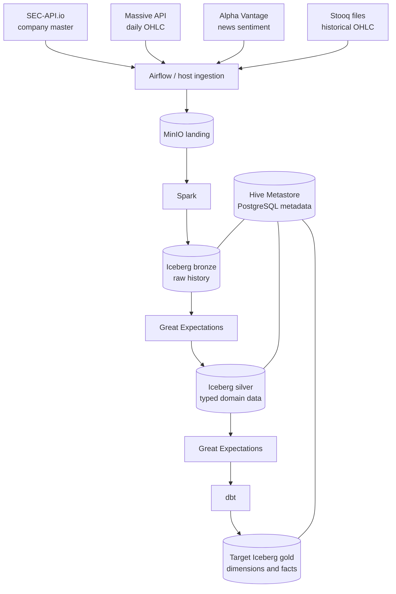

# Architecture

> **Status:** This page describes the target system boundaries and the checked-in component topology. Several connections and publication steps in the flow are not operational end to end; verified gaps are maintained in [Implementation status](implementation-status.md).

## Scope

This repository is a local batch lakehouse for US equity reference data, end-of-day prices, and market-news sentiment. It emphasizes reproducibility, source lineage, incremental processing, and dimensional modeling.

High availability, multi-tenancy, autoscaling, and production security are outside the current scope.

## System flow



## Component responsibilities

| Component | Responsibility | Explicitly does not own |
|---|---|---|
| Airflow / host uploader | Scheduled API extraction and manual historical-file ingestion into landing | Domain transformation or gold modeling |
| MinIO | S3-compatible landing and Iceberg object storage | Table metadata or orchestration state |
| Spark | Landing-to-bronze and bronze-to-silver processing | API scheduling or business-facing dimensional models |
| Iceberg | Atomic table commits, snapshots, partitioning, and incremental read boundaries | Workflow orchestration |
| Hive Metastore | Logical namespace and table metadata | Object contents |
| Great Expectations | Layer validation and publication gates | Transformation logic |
| dbt | Gold dimensions, facts, snapshots, lineage, and SQL tests | Raw provider parsing |
| PostgreSQL | Separate metadata databases for Hive and Airflow | Analytical facts |

The `staging` MinIO bucket is reserved. No implemented batch step currently reads from or writes to it.

## Architectural decisions and trade-offs

| Decision | Reason | Trade-off |
|---|---|---|
| Preserve complete API responses in landing | Enables replay, auditing, and retention of provider metadata | Silver must understand each provider envelope |
| Use MinIO through S3/S3A | Keeps local development close to cloud object-storage semantics | Networking and credentials require explicit configuration |
| Use Iceberg for bronze and silver | Atomic commits, snapshots, and partition evolution support incremental batch workloads | Spark, Iceberg, Hadoop, and catalog versions must be aligned |
| Separate Hive metadata from objects | Allows engines to resolve common logical tables | The metastore becomes required infrastructure |
| Use Airflow for orchestration and Spark for transformation | Separates API I/O from distributed compute | Cross-system run identity and checkpoints must be explicit |
| Validate before checkpoint advancement | Makes data quality part of control flow | Failed post-commit validation requires resumable replay and publication-isolation semantics |
| Use dbt only for gold | Keeps business models and SQL lineage separate from raw parsing | dbt sources must remain synchronized with silver contracts |

Candidate decisions and the ADR template are maintained in the [architecture decision register](decisions/README.md). Numbered ADRs will be added as cross-layer choices are stabilized.

## Storage architecture

MinIO owns three buckets:

| Bucket | Purpose |
|---|---|
| `landing` | Source-faithful, run-scoped API responses and source files |
| `staging` | Reserved for future intermediate materialization |
| `iceberg` | Physical data and metadata files for medallion tables |

The intended catalog namespaces are:

```text
hive_prod.bronze
hive_prod.silver
hive_prod.gold
hive_prod.snapshots
hive_prod.metadata
```

`hive_prod.snapshots` is dbt-owned SCD history; it is an internal input to gold dimensions rather than a consumer-facing medallion layer. `hive_prod.metadata` owns checkpoints, reconciliation, and the target publication manifest.

## Validation-gated publication

The recommended target is a write-audit-publish contract:

1. write each candidate to an Iceberg audit branch or isolated staging table;
2. capture candidate snapshot IDs and reconcile every required output;
3. run the layer's validation suite;
4. append one `published` manifest record containing the exact table/snapshot set for the publication group;
5. allow trusted downstream jobs to read only snapshot IDs resolved from that manifest.

One manifest row can publish the news parent and both association tables as a group even though Iceberg has no cross-table transaction. Failed candidate snapshots remain diagnostic state and are never referenced by a successful manifest. Direct ad hoc reads of physical table heads bypass this trust boundary and are therefore not the supported consumption contract.

Source-to-silver schemas, grains, and ownership rules are defined in [Data contracts](data-contracts.md); dimensional grains and relationships are defined in [Gold data model](gold-data-model.md).

Retention automation is not configured. Two safety invariants apply before snapshot expiration or orphan cleanup is introduced:

- do not remove a landing object while retained downstream lineage or replay policy depends on it;
- retain a consumer's checkpoint snapshot and every snapshot in the incremental ancestry/range required to reach the current published snapshot.

Retention periods, legal/business requirements, Iceberg snapshot expiration, and orphan-file cleanup remain an open architectural decision.

## Dependency compatibility

| Component | Current declaration | Review note |
|---|---|---|
| Airflow | `3.0.0` | Pinned in the custom image |
| Spark services | `3.5.0` | Pinned in Compose |
| Iceberg artifact | Spark `3.4`, Scala `2.12`, Iceberg `1.10.0` | Does not match the declared Spark 3.5 runtime |
| Hive Metastore | `3.1.2-e.18` | Verify against the selected Iceberg catalog/runtime |
| Great Expectations | `1.9.0` | Suite code must consistently use this version's API |
| dbt Spark adapter | Unpinned | dbt Core and adapter versions must be pinned together |
| MinIO | Unpinned image | Pin a tested release for reproducible builds |
| PostgreSQL | `11` for Hive; `13` for Airflow | Independent backup and upgrade plans are required |

These are checked-in declarations, not a verified compatibility matrix. The active Spark services do not reference the custom Spark Dockerfile, so its Iceberg and S3 dependencies are absent even before the version mismatch is addressed. Operational consequences are tracked in [Implementation status](implementation-status.md).

## Repository map

```text
.
├── airflow/
│   ├── dags/                  # API ingestion DAGs and shared helpers
│   ├── config/                # Airflow configuration
│   ├── Dockerfile             # Airflow 3 image
│   └── docker-compose.yaml    # Airflow services
├── docker/
│   ├── docker-compose.yaml    # MinIO, Hive Metastore, Spark
│   └── spark/
│       ├── spark-apps/        # Mounted Spark applications
│       └── spark-config/      # Spark, Hive, and S3A configuration
├── scripts/batch/
│   ├── common/                # Spark session factory
│   ├── jobs/                  # Bronze and silver jobs
│   ├── data_validation/       # Great Expectations code
│   ├── gx/                    # Great Expectations project
│   └── utils/                 # Watermark and naming helpers
├── dbt/
│   ├── models/                # Gold dimensions and facts
│   ├── snapshots/             # Company SCD snapshot
│   ├── macros/                # Surrogate-key helpers
│   └── seeds/                 # Static topic data
├── docs/                      # Architecture and operating documentation
└── requirements.txt           # Host-side batch dependencies
```

## Related documents

- [Data contracts](data-contracts.md)
- [Gold data model](gold-data-model.md)
- [Incremental loading](incremental-loading.md)
- [Operations](operations.md)
- [Quality and observability](quality-and-observability.md)
- [Implementation status](implementation-status.md)
- [Documentation index](README.md)
- [Project README](../README.md)
