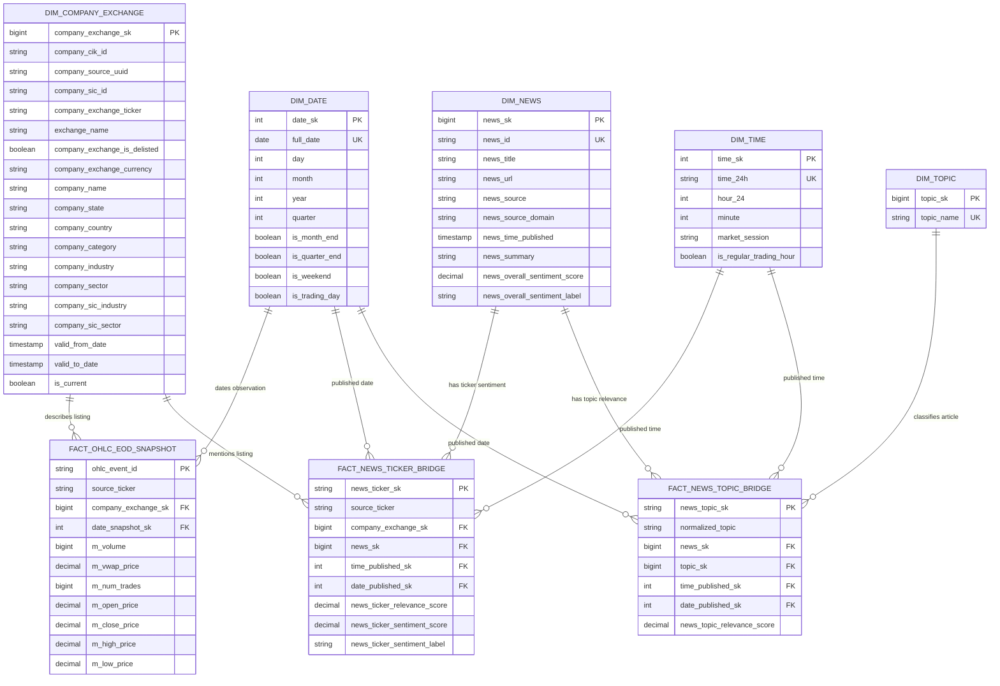

# Gold data model

> **Status:** This is the target analytical model derived from the supplied gold-layer diagram. The checked-in dbt project is partial and does not yet implement this contract end to end. Verified gaps remain in [Implementation status](implementation-status.md).

## Scope and ownership

The gold layer is a dimensional model for three analytical subjects:

- end-of-day market observations by listed security and market date;
- news-to-security sentiment associations;
- news-to-topic relevance associations.

dbt is the only gold writer. Spark publishes typed silver inputs; dbt owns the company SCD2 snapshot, conformed dimensions, bridge/fact models, keys, relationships, and gold tests.

This document owns gold grains, dimensional semantics, primary/foreign keys, fact measures, and supported join paths. Cross-layer source schemas remain in [Data contracts](data-contracts.md), execution behavior in [Incremental loading](incremental-loading.md), and dbt commands in [Operations](operations.md).

## Model overview

The repository-native diagram below makes the supplied image searchable and reviewable in version control.



The entity diagram cannot express every composite uniqueness rule. Those rules are contractual below and must be executable dbt tests.

## Diagram normalization decisions

The supplied diagram establishes the intended relationships. These naming and semantic adjustments remove ambiguity before implementation:

| Supplied label or implication | Canonical contract |
|---|---|
| `company_exchange_id` as an integer | Preserve SEC CIK as `company_cik_id` string; define any additional provider UUID separately |
| Listing identity implied by one ID | Natural listing key is `(exchange_name, company_exchange_ticker, company_cik_id)` |
| `dim_news` without a durable natural key | Retain silver `news_id = sha256(url_norm)` and test it unique |
| `news_url` as the only unique identity | URL remains an attribute; normalized URL participates in deriving `news_id` |
| `m_weighted_volume` | Rename to `m_vwap_price`: Massive `vw` is volume-weighted average price, not weighted volume |
| Floating-point scores | Prefer bounded fixed-precision decimals for reproducible comparisons and tests |
| Ticker sentiment score without its provider label | Retain the provider `ticker_sentiment_label`; do not infer it unless a tested provider-compatible rule is accepted |
| Provider UUID and SIC details omitted from the visual | Retain them as descriptive/audit attributes; they already exist upstream and are not derivable later |
| Integer surrogate keys | Logical types are illustrative; generated keys must be stable and large enough for expected cardinality |
| News “fact” tables | They are measured association bridges: one row per news/listing or news/topic relationship |

These decisions should be reflected in the next revision of the visual model and dbt schema YAML.

## Table catalog

| Object | Exact grain | Primary or durable key | Source | History behavior |
|---|---|---|---|---|
| `hive_prod.snapshots.snap_dim_company_exchange` | One observed SCD version per listing | `dbt_scd_id`; natural key `(exchange, ticker, cik)` | `silver.companies` | dbt SCD2 state |
| `hive_prod.gold.dim_company_exchange` | One SCD2 version of one security listing | `company_exchange_sk`; unique `dbt_scd_id` | Company snapshot | Versioned dimension |
| `hive_prod.gold.dim_news` | One normalized article | `news_sk`; unique `news_id` | `silver.news_sentiment` | Upsert current normalized article |
| `hive_prod.gold.dim_topic` | One canonical topic | `topic_sk`; unique normalized `topic_name` | dbt seed | Reference dimension |
| `hive_prod.gold.dim_date` | One calendar date | `date_sk`; unique `full_date` | Generated calendar | Static/conformed dimension |
| `hive_prod.gold.dim_time` | One minute of reporting-local time | `time_sk`; unique `time_24h` | Generated series | Static/conformed dimension |
| `hive_prod.gold.fact_ohlc_eod_snapshot` | One source OHLC event resolved to one listing version | `ohlc_event_id`; resolved uniqueness `(company_exchange_sk, date_snapshot_sk)` | `silver.ohlcs` plus dimensions | Keyed event upsert |
| `hive_prod.gold.fact_news_ticker_bridge` | One article/source-ticker association resolved to one listing | `news_ticker_sk = sha256(news_id, source_ticker)`; resolved uniqueness `(news_sk, company_exchange_sk)` | Silver news-ticker associations | Keyed association upsert |
| `hive_prod.gold.fact_news_topic_bridge` | One article/normalized-topic association | `news_topic_sk = sha256(news_id, normalized_topic)`; resolved uniqueness `(news_sk, topic_sk)` | Silver news-topic associations | Keyed association upsert |

### `snap_dim_company_exchange`

This dbt snapshot is internal SCD state in `hive_prod.snapshots`, not a consumer-facing dimension. It compares monthly published listing snapshots at natural key `(exchange, ticker, cik)`, retains `dbt_scd_id`, and supplies inserted and closed versions to `dim_company_exchange`.

### `dim_company_exchange`

This is a listing dimension, not merely a legal-company dimension. One CIK may have multiple tickers or exchange listings.

| Column group | Contract |
|---|---|
| Surrogate key | `company_exchange_sk`, stable for one SCD version |
| Natural key | `(exchange_name, company_exchange_ticker, company_cik_id)` |
| Listing attributes | ticker, exchange, currency, delisting status |
| Company attributes | name, state, country, category, industry, sector, SIC ID/industry/sector, provider UUID |
| SCD fields | `valid_from_date`, `valid_to_date`, `is_current`, plus retained `dbt_scd_id` |
| Required uniqueness | One row per `company_exchange_sk`; one current row per natural listing key; no overlapping validity intervals |

The physical model should also retain the provider UUID when available. CIK remains a string because formatting and leading zeros are identity concerns, not numeric measures.

### `dim_news`

| Column group | Contract |
|---|---|
| Surrogate key | `news_sk` |
| Natural key | `news_id`, derived upstream from normalized URL |
| Descriptive attributes | title, original URL, provider source, source domain, summary |
| Event attribute | `news_time_published`, normalized to UTC |
| Sentiment attributes | overall sentiment score and provider label |
| Required uniqueness | `news_sk`, `news_id`; normalized URL collisions must be investigated rather than arbitrarily deduplicated |

`news_id` must remain in the dimension even though the supplied image shows `news_url` as unique. Facts need a durable natural key to resolve `news_sk` during replay and correction.

### `dim_topic`

`dim_topic` is a small reference dimension populated from `dbt/seeds/dim_topic.csv`.

| Column | Contract |
|---|---|
| `topic_sk` | Stable surrogate key |
| `topic_name` | Canonically cased display name; normalized value is unique |

Seed changes are reviewed data-contract changes. Renaming a topic must not silently create a second semantic member.

### `dim_date`

| Column | Contract |
|---|---|
| `date_sk` | Integer `YYYYMMDD` |
| `full_date` | Unique calendar date |
| `day`, `month`, `year`, `quarter` | Calendar components |
| `is_month_end`, `is_quarter_end` | Calendar-period flags |
| `is_weekend` | True only for Saturday or Sunday |
| `is_trading_day` | Exchange-calendar result; not simply `not is_weekend` |

The supported calendar range must cover the earliest historical observation through the platform planning horizon. Exchange holidays and special closures require a maintained market calendar.

### `dim_time`

`dim_time` contains exactly 1,440 rows at one-minute grain.

| Column | Contract |
|---|---|
| `time_sk` | Integer `HHMM` in reporting-local time; midnight is valid key `0` |
| `time_24h` | Zero-padded `HHMM` string |
| `hour_24`, `minute` | Numeric components |
| `market_session` | `pre_market`, `regular`, `after_hours`, or `outside_session` |
| `is_regular_trading_hour` | True for reporting-local minutes `[09:30, 16:00)` |

All source timestamps are normalized and retained in UTC. Date/time foreign keys used for US market analysis are derived only after conversion with the IANA timezone `America/New_York`, which handles daylight-saving transitions. Never apply a fixed UTC offset.

Market sessions are half-open `America/New_York` intervals:

```text
pre_market       [04:00, 09:30)
regular          [09:30, 16:00)
after_hours      [16:00, 20:00)
outside_session  all other minutes
```

### `fact_ohlc_eod_snapshot`

Grain: one end-of-day observation for one resolved listing version and market date.

| Column | Type/role | Rule |
|---|---|---|
| `ohlc_event_id` | Durable event key | Deterministic hash of canonical silver `(ticker, event_ts)`; unchanged if dimension resolution is repaired |
| `source_ticker` | Degenerate natural key | Exact normalized ticker used to resolve the listing |
| `company_exchange_sk` | FK | Resolved to the applicable listing SCD version |
| `date_snapshot_sk` | FK | Observation date in `dim_date` |
| `m_volume` | `bigint` measure | Non-negative |
| `m_vwap_price` | decimal measure | Source `vw`; non-negative when present |
| `m_num_trades` | `bigint` measure | Non-negative |
| `m_open_price`, `m_close_price` | `decimal(19,4)` measures | Must lie between low and high |
| `m_high_price`, `m_low_price` | `decimal(19,4)` measures | `m_low_price <= m_high_price` |

`ohlc_event_id` is the durable fact identity. For resolved published rows, `(company_exchange_sk, date_snapshot_sk)` is also unique. A correction updates the existing event; repairing an SCD lookup can change the foreign key without changing event identity.

### `fact_news_ticker_bridge`

Grain: one normalized article associated with one resolved listing.

| Column | Role |
|---|---|
| `news_ticker_sk` | Deterministic SHA-256 of `(news_id, source_ticker)` |
| `source_ticker` | Provider ticker retained for resolution and replay |
| `company_exchange_sk` | Listing-version FK |
| `news_sk` | Article FK |
| `date_published_sk`, `time_published_sk` | Role-playing publication date/time FKs |
| `news_ticker_relevance_score` | Provider relevance measure; target precision `decimal(9,8)` |
| `news_ticker_sentiment_score` | Provider ticker-specific sentiment measure; target precision `decimal(9,8)` |
| `news_ticker_sentiment_label` | Provider label retained as a degenerate attribute |

The durable business uniqueness rule is `(news_id, source_ticker)`. For resolved published rows, `(news_sk, company_exchange_sk)` is also unique. The surrogate key does not replace either test.

### `fact_news_topic_bridge`

Grain: one normalized article associated with one canonical topic.

| Column | Role |
|---|---|
| `news_topic_sk` | Deterministic SHA-256 of `(news_id, normalized_topic)` |
| `normalized_topic` | Upstream topic value used to resolve `topic_sk` |
| `news_sk` | Article FK |
| `topic_sk` | Topic FK |
| `date_published_sk`, `time_published_sk` | Role-playing publication date/time FKs |
| `news_topic_relevance_score` | Provider topic-relevance measure; target precision `decimal(9,8)` |

The durable business uniqueness rule is `(news_id, normalized_topic)`. For resolved published rows, `(news_sk, topic_sk)` is also unique.

## Relationship and cardinality rules

- One company-listing version has zero or many OHLC facts and news-ticker associations.
- One news article has zero or many ticker associations and zero or many topic associations.
- One topic has zero or many news-topic associations.
- One date/minute member can describe many facts; every published fact must resolve both required role-playing keys.
- Dimensions must never join to a bridge through descriptive text when a surrogate key is available.
- Analysts should join through the documented dimensions and facts, not directly from one bridge to another.

The date and time keys on both news bridges must agree with `dim_news.news_time_published` after the documented reporting-timezone conversion. This is a testable denormalization invariant.

## Company SCD2 and point-in-time resolution

The company snapshot must use the listing natural key `(exchange, ticker, cik)`, not `cik` alone. It closes the previous row and creates a version when a tracked listing/company attribute changes.

Target resolution for a fact event is:

```text
fact listing identity = dimension natural listing key
fact event/source date >= valid_from_date
fact event/source date <  valid_to_date
```

Use half-open intervals `[valid_from_date, valid_to_date)`. Exactly one version may match. Zero or multiple matches keep the candidate unresolved and fail publication.

The consumer dimension and internal dbt snapshot have two distinct time axes:

| Time axis | Fields | Meaning |
|---|---|---|
| Technical snapshot time | `dbt_valid_from`, `dbt_valid_to`, `dbt_updated_at` | When dbt detected and recorded the row version |
| Source-observed validity | `valid_from_date`, `valid_to_date` | Interval derived from chronological monthly source snapshot dates and used for fact resolution |

Current source-observed rows use `valid_to_date = 9999-12-31 00:00:00` and `is_current = true`; closed rows use the next observed change/disappearance timestamp and `is_current = false`. A listing missing from a later full monthly snapshot closes at that later snapshot's source date. Implement this with snapshot hard-delete handling or an explicit tombstone model.

Source-observed validity does not prove the legal or exchange-effective time of a change. Historical “as-of” claims must disclose this limitation unless authoritative effective dates are added. Fact joins use source-observed fields, never the dbt execution timestamps.

OHLC and news-ticker inputs currently identify a ticker, not necessarily exchange and CIK. If zero or multiple listing versions match at the event/publication time, the candidate row remains unresolved until enriched with exchange/listing identity; the build must not select an arbitrary listing.

Closing an SCD row updates the existing version's `valid_to_date`. Therefore `dim_company_exchange` must consume both inserted snapshot versions and updates to existing versions. Filtering only on a newer `dbt_valid_from` misses closures.

## Surrogate and unknown-member policy

- `date_sk` and `time_sk` are deterministic semantic keys (`YYYYMMDD`, `HHMM`); `time_sk = 0` is midnight, not an unknown member.
- Source-derived dimensions use deterministic hashes converted to a supported stable type, or a transactionally maintained key map.
- Fact/bridge identities are deterministic from upstream natural keys: `(ticker, event_ts)`, `(news_id, source_ticker)`, and `(news_id, normalized_topic)`.
- Do not allocate keys using `max(existing_key) + row_number()` in distributed/concurrent builds.
- If a future optional, non-grain-defining role needs an unknown member, reserve `-1`; never overload a valid date/time key.
- Every foreign key in the supplied model participates in fact meaning or uniqueness and must resolve before publication. A shared unknown company/topic/news key would collapse distinct source rows at the documented fact grain.
- Keep unresolved rows in the unpublished candidate/reconciliation state with their natural keys and explicit counts; reprocess them after the dimension becomes available. Never silently drop them or choose an arbitrary member.
- Natural and composite keys remain covered by uniqueness tests even when a surrogate primary key exists.

## Gold audit fields

The logical diagram omits operational metadata for readability. Every source-derived gold model should also retain:

```text
source_publication_id
gold_loaded_at
dbt_invocation_id
```

These fields connect a gold row to the validated silver publication consumed by dbt. Generated dimensions and seeds retain `gold_loaded_at` and the dbt invocation/model version that produced them.

## Target dbt model dependency order

```text
1. Resolve the latest validated silver publication manifest.
2. Build/test dim_date, dim_time, and dim_topic.
3. Run snap_dim_company_exchange.
4. Merge dim_company_exchange, including newly closed SCD versions.
5. Merge dim_news by news_id.
6. Merge fact_ohlc_eod_snapshot by listing/date.
7. Merge fact_news_ticker_bridge by article/listing.
8. Merge fact_news_topic_bridge by article/topic.
9. Run relationship, uniqueness, measure, and freshness tests.
10. Record successful per-model/batch publication state.
```

A normal multi-model `dbt build` is not an atomic cross-table release. This order describes dbt dependencies, while cross-layer orchestration belongs to [Incremental loading](incremental-loading.md). The publication contract is detailed in [Quality and observability](quality-and-observability.md#gold-publication-scope).

## Required dbt tests

At minimum:

- unique and not-null tests on every surrogate key;
- unique tests on durable fact/bridge natural identities, resolved FK combinations, and the company listing natural key;
- relationship and not-null tests for every published foreign key, plus zero unresolved candidates at publication;
- one-current-row and non-overlapping-window tests for company SCD2 history;
- accepted-value tests for sentiment labels, market sessions, currencies, and boolean flags;
- bounded score tests for relevance/sentiment measures according to the provider contract;
- OHLC price-order and non-negative volume/trade tests;
- date/time derivation tests between news dimensions and bridges;
- source freshness and source-publication lineage tests.

Once implemented, dbt schema YAML should be the executable column/test authority. This document remains the semantic authority and should not duplicate every low-level description indefinitely.

## Current implementation alignment

Current implementation: **Partial**. Checked-in bridge filenames use `fact_news_symbol` and `fact_news_topic`, while this target contract uses `fact_news_ticker_bridge` and `fact_news_topic_bridge`. See [Implementation status](implementation-status.md) for the canonical defect list and readiness assessment.

## Related documents

- [Data contracts](data-contracts.md)
- [Architecture](architecture.md)
- [Architecture decision register](decisions/README.md)
- [Incremental loading](incremental-loading.md)
- [Quality and observability](quality-and-observability.md)
- [Implementation status](implementation-status.md)
- [Operations](operations.md)
- [Documentation index](README.md)
- [Project README](../README.md)
