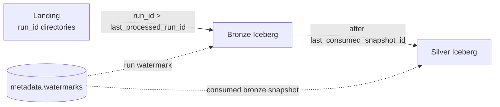
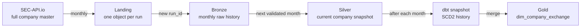
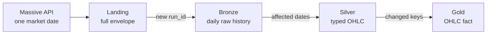
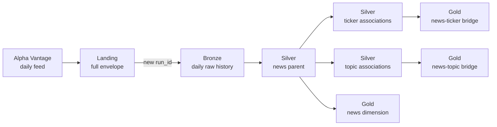

# Incremental loading

> **Status:** High-watermark processing is designed and partially coded at Landing -> Bronze and Bronze -> Silver. It is not operational end to end. Exact defects are tracked in [Implementation status](implementation-status.md).

This document owns read scope, write mode, watermark advancement, replay, correction, and late-discovery behavior. Source-to-silver schemas and grains are defined in [Data contracts](data-contracts.md); gold dimensional contracts are in [Gold data model](gold-data-model.md).

## Executive summary

| Dataset | Landing | Bronze | Silver | Gold |
|---|---|---|---|---|
| Companies | Monthly append by run; retry may replace before consumption | Append monotonic raw runs | Read the next validated month; overwrite current snapshot | dbt SCD2 snapshot, then dimension merge |
| OHLC | Daily append by run; retry may replace before consumption | Append monotonic raw runs | Read affected dates; merge `(ticker, event_ts)` | Fact merge |
| News | Daily append by run; retry may replace before consumption | Append monotonic raw runs | Read affected dates; merge parent and synchronize children | Dimension/fact merges |

## High-watermark design

The pipeline uses two checkpoints:



| Boundary | Watermark | First load | Later loads | Checkpoint advances after |
|---|---|---|---|---|
| Landing -> Bronze | `last_processed_run_id` for the bronze target | All discovered runs | Runs whose ID is greater than the watermark | Bronze write and validation |
| Bronze -> Silver | `last_consumed_snapshot_id` for the silver publication group | Full published bronze table | Changes after the consumed snapshot through the latest published bronze snapshot | Group manifest plus all required silver validations |

`last_consumed_snapshot_id` means the **bronze input snapshot completely consumed by silver**, not a snapshot created by the silver write. Current helper code calls this field `last_snapshot_id`; renaming it is part of the watermark-schema repair.

### Landing -> Bronze algorithm

```text
1. Discover and sort run IDs for one canonical dataset.
2. Read that bronze target's last_processed_run_id.
3. Select run_id > last_processed_run_id.
4. Return a successful no-op when no candidate exists.
5. Read and pre-validate candidate source objects.
6. Append only candidates not already recorded as written; capture the output snapshot.
7. Validate committed bronze rows and reconcile counts.
8. Mark each validated run published in the run ledger.
9. Store max(candidate run_id) only after the contiguous batch succeeds.
```

This intent appears in [`bronze.py`](../scripts/batch/jobs/bronze.py) and [`helpers.py`](../scripts/batch/utils/helpers.py).

The run ID must be monotonic and lexicographically sortable, for example `20260324T003000Z`. Random UUIDs and non-zero-padded dates cannot safely act as ordered high watermarks.

### Bronze -> Silver algorithm

```text
1. Read the silver publication group's last_consumed_snapshot_id.
2. Resolve the corresponding bronze table's latest successfully published snapshot ID.
3. With no watermark, read the full bronze table.
4. If current == watermark, return a successful no-op.
5. Otherwise read the Iceberg change range through that published snapshot.
6. Transform and write candidate snapshots for every required parent/child target.
7. Validate and reconcile the complete output group.
8. Append one publication manifest containing the validated output snapshot set.
9. Save the consumed bronze publication/snapshot as the group checkpoint.
```

This intent appears in [`silver.py`](../scripts/batch/jobs/silver.py).

Snapshot-range reads are suitable for append snapshots. Overwrites, deletes, and partition replacement must instead identify and rebuild affected partitions or consume a change log that represents those operations.

### Checkpoint rules

- Never advance before the target commit.
- Never advance after failed validation.
- Advance to a batch maximum only if all preceding candidates succeeded as one contiguous batch.
- A retry reads the same stored checkpoint and cannot duplicate business keys.
- If a write committed before validation failed, a retry locates that run by ledger identity/checksum and resumes validation; it does not append the run again.
- Do not substitute `source_date`, ingestion time, or a target-table maximum timestamp for the declared checkpoint.
- Backlogged company months are published sequentially so dbt captures intermediate SCD states.
- Retain the checkpoint snapshot and every snapshot in the incremental ancestry/range needed to reach the latest published input until the consumer advances.
- Trusted downstream jobs resolve input snapshot IDs from successful publication manifests, never from the unconstrained physical table head.
- A run-scoped landing object becomes immutable at its first downstream write; any later correction receives a new `run_id`.
- A newly published append snapshot must descend from the prior published snapshot. A non-ancestor correction takes the documented rebuild path rather than an incremental range read.

### Target metadata schema

At minimum, the high-watermark table needs:

```text
checkpoint_key              string   logical primary identity
dataset                     string
boundary                    string
input_relation              string
publication_group           string
last_processed_run_id        string   nullable
last_consumed_snapshot_id    long     nullable
last_consumed_publication_id string   nullable
updated_at                   timestamp
```

`checkpoint_key` identifies one consumer boundary, for example `bronze_to_silver.news_sentiments`; this allows the news parent and child tables to publish as one group. The current helper keys only by a loosely qualified table name. Its `last_snapshot_id` column must be migrated to `last_consumed_snapshot_id` so input/output ownership is unambiguous.

The target `metadata.publications` table stores one atomic trust declaration per group:

```text
publication_id              string
publication_key             string   unique deterministic identity
publication_group           string
dataset                     string
boundary                    string
source_run_ids              array<string>
input_publication_id        string   nullable
input_snapshot_id           long     nullable
outputs                     array<struct<table_name:string,snapshot_id:long>>
validation_status           string   must equal 'passed'
published_at                timestamp
```

`publication_key` is a deterministic hash of `(publication_group, input_publication_id/input_snapshot_id, sorted output table/snapshot set)`. Candidate table snapshots may exist without a publication row, and consumers ignore them. A single manifest row can reference all three news outputs and therefore prevents a partial parent/child group from becoming trusted.

Manifest insertion and checkpoint advancement are separate idempotent commits. If a retry finds an existing `passed` manifest with the expected deterministic key, it does not republish or rewrite outputs; it only repairs/advances the stale checkpoint. A conflicting manifest under the same key fails closed. This write-audit-publish contract is the recommended target; the repository does not implement it yet.

### Scope of the simple high watermark

The maximum watermark is safe for the normal path when runs are discovered in increasing `run_id` order. A source business date may arrive late and still be selected if ingestion assigns it a new, increasing run ID.

The maximum alone cannot:

- recover an unprocessed run discovered later with `run_id <= last_processed_run_id`;
- select one correction when several runs represent the same source date;
- record separate written, validated, and published states;
- prove row-count reconciliation for every logical run.

Until the companion run ledger and correction-selection policy are implemented, these cases must fail closed or use an isolated, documented rebuild. A job must not silently choose a version by file-listing order or replace current company state with an old corrected month.

## Write-operation vocabulary

| Operation | Scope | History |
|---|---|---|
| Append | Add an unseen run/source period | Existing state remains |
| Replace same object | Rewrite the exact same unconsumed run-scoped landing key | Other runs remain; a consumed object is immutable |
| Dynamic partition overwrite | Atomically replace one complete source-period partition | Other partitions remain |
| Full snapshot overwrite | Atomically replace a current-state table | History lives elsewhere |
| Merge/upsert | Update matching business keys and insert new keys | Keyed history/current state remains |
| dbt snapshot | Compare current rows and maintain SCD validity windows | SCD2 history remains |

“Overwrite” must always name its scope. A table overwrite is not interchangeable with a dynamic partition overwrite.

Preferred primitives:

| Contract operation | Primitive |
|---|---|
| Same-run landing retry before consumption | `S3Hook.load_bytes(..., replace=True)` on the exact run key and verify checksum |
| Bronze append | Iceberg DataFrameWriterV2 `append()` |
| Partition correction, after selection policy exists | DataFrameWriterV2 `overwritePartitions()` with complete desired partition contents |
| Company current-state publication | Validate staged output, then atomic Iceberg table overwrite |
| Silver event/association upsert | Iceberg `MERGE INTO` with the documented key |
| Gold upsert | dbt incremental merge with explicit `unique_key` |
| Company history | dbt snapshot with listing-grain key and hard-delete policy |

## Companies: monthly master data



| Stage | Read | Write | Rerun/correction | Retained state |
|---|---|---|---|---|
| API -> Landing | Complete NASDAQ mapping | New run-scoped JSON object | Retry may replace only before consumption; later recrawl/correction gets a new run ID | Every monthly source payload |
| Landing -> Bronze | Bootstrap: all unprocessed months; normal: new month | Append validated monotonic raw run | Duplicate run identity is a no-op; corrections wait for an explicit selection/rebuild policy | Raw monthly runs |
| Bronze -> Silver | Next validated monthly full snapshot | Atomic full overwrite after validation | Same input produces same current keys/count | Current listing state only |
| Silver -> dbt snapshot | Current published silver snapshot | Close changed versions and insert new versions | Unchanged input creates no SCD version | SCD2 listing history |
| Snapshot -> Gold | Inserted versions and updates that close prior versions | Merge by `dbt_scd_id`, or rebuild from snapshot | Reuses existing version keys and refreshes validity windows | Query-ready SCD history |

Important rules:

- Business grain is `(exchange, ticker, cik)`, not `cik` alone.
- If multiple runs exist for a month, hold publication until the run ledger records one selected version; listing order is not a selection rule.
- Backlogged months are processed chronologically, with a dbt snapshot after each silver publication.
- Configure snapshot hard-delete handling if a listing disappearing from a full monthly master should close its active version.
- Correcting an old month must not replace today's silver state. Use a controlled historical rebuild or isolated SCD repair.
- dbt snapshot timestamps describe when the platform observed a change unless a source-effective date is modeled separately.
- Gold must consume both new SCD rows and updates to prior rows' `dbt_valid_to`; a filter based only on newer `dbt_valid_from` values misses closures.

Expected reconciliation:

```text
landing company count
  = parsed bronze count before rejects
  = silver input count before required-field filtering/deduplication

silver published count
  = unique valid (exchange, ticker, cik) rows in the monthly snapshot
```

Example:

```text
March:
  append landing -> append March bronze -> overwrite silver current
  -> snapshot March state -> merge gold

April:
  append landing -> append April bronze -> overwrite silver current
  -> close changed March versions -> insert April versions -> merge gold

April logical-run replay:
  no duplicate bronze run -> same silver keys/count
  -> no new SCD version -> no duplicate gold row
```

## OHLC: daily event history



| Stage | Read | Write | Rerun/correction | Retained state |
|---|---|---|---|---|
| API -> Landing | One market date | Run-scoped response object | Retry may replace only before consumption; later correction gets a new run | Every response version |
| Landing -> Bronze | Unprocessed monotonic runs | Append raw run | Checkpoint prevents a same-run duplicate; reconciliation ledger is the target audit record | Raw daily history |
| Bronze -> Silver | Affected validated dates | Merge `(ticker, event_ts)` | Existing keys update; new keys insert | Typed OHLC history |
| Silver -> Gold | New/changed OHLC keys | Merge one ticker/date fact | Replayed date updates matching facts | Analytical history |

If bronze permits partition replacement, an append-only snapshot scan is insufficient. The job must know which selected source-date version to rebuild.

Historical Stooq and Massive data can overlap. Before they converge in silver, define deterministic source precedence for `(ticker, event_ts)`. Conflicts should fail validation until that policy is accepted.

Historical Stooq files follow a separate landing-to-`bronze.ohlc_history_files` path because each object contains many event dates. Once a fixture-backed parser and precedence rule exist, parsed rows merge into the same silver OHLC grain. Historical ingestion currently stops at landing.

## News: daily parent and associations



| Stage | Read | Write | Rerun/correction | Retained state |
|---|---|---|---|---|
| API -> Landing | One date's response | Run-scoped envelope | Retry may replace only before consumption; later recrawl gets a new run | Every response version |
| Landing -> Bronze | Unprocessed runs | Append raw run | Run identity prevents duplicate commit | Raw daily history |
| Bronze -> Parent Silver | Validated affected dates | Merge by `news_id` | Reappearing article updates same parent | Latest normalized article plus lineage |
| Parent -> Child Silver | Current arrays for affected articles | Synchronize then merge composite keys | Removed associations are deleted/expired | Current relationships |
| Silver -> Gold | Changed parent/child keys | Dimension and fact merges | Replays update matching keys | Analytical relationships |

If more than one run exists for a source date, hold publication until the run ledger selects a version before parent and child synchronization.

## Required run ledger for recovery and corrections

A maximum high watermark is efficient when input is monotonic, complete, and discovered in order. It can skip a late-discovered or backfilled run whose ID sorts below the stored maximum; this is different from an older business date assigned a new increasing ingestion ID.

The target control plane retains the high watermark for fast normal selection and adds a per-run ledger:

| Field | Purpose |
|---|---|
| `dataset`, `boundary`, `publication_group`, `run_id` | Processing identity |
| `source_date`, `source_file`, `source_checksum` | Input identity/change detection |
| `source_snapshot_id` | Consumed Iceberg input snapshot when applicable |
| `publication_id` | Successful group manifest; its output array is authoritative for all output snapshots |
| `status` | `discovered`, `written`, `validated`, `published`, `failed` |
| `selection_status` | `pending`, `selected`, `superseded`, or `rejected` when source-date versions conflict |
| `input_rows`, `rejected_rows` | Run-level counts; per-output rows/snapshots live in reconciliation records |
| `started_at`, `completed_at`, `error_message` | Operations |

Normal discovery uses the high-watermark predicate. A reconciliation pass anti-joins all source runs against successfully published ledger rows to recover late-discovered or failed inputs. The ledger is required target infrastructure for those cases and for correction selection; it is not current behavior and does not replace the normal high-watermark fast path.

## End-to-end sequence

```text
1. Fetch source payload.
2. Write deterministic run-scoped landing object.
3. Confirm object, checksum, and source count.
4. Discover candidates after the landing high watermark.
5. Write candidate bronze data and capture its snapshot.
6. Validate/reconcile bronze and append its publication manifest.
7. Advance last_processed_run_id.
8. Resolve the latest published bronze snapshot after the consumed watermark.
9. Transform and write candidate silver parent/child snapshots.
10. Validate/reconcile the complete silver publication group.
11. Append the group manifest and advance last_consumed_snapshot_id/publication_id.
12. Run dbt snapshot/build/tests against published silver inputs.
```

## Failure and replay matrix

| Failure | Retry behavior |
|---|---|
| API read before landing | Airflow retries; no object/checkpoint change |
| Landing write before consumption | Retry the same run-scoped key; checksum must match the final accepted object |
| Bronze write before commit | No Iceberg snapshot/checkpoint advancement |
| Bronze validation after commit | Resume validation from the ledger-recorded output snapshot; do not append the same run again |
| Silver candidate write | Bronze remains valid; silver input watermark does not advance |
| Silver validation | Do not append a publication manifest or run gold; candidate snapshots remain diagnostic only |
| Manifest write | Retry the deterministic publication key; an existing identical `passed` manifest is success |
| Checkpoint write after manifest | Locate the passed manifest and advance/repair only the checkpoint; do not rewrite outputs |
| dbt model/test | Repair and rerun dbt without re-ingestion |

## Related documents

- [Data contracts](data-contracts.md)
- [Gold data model](gold-data-model.md)
- [Architecture](architecture.md)
- [Quality and observability](quality-and-observability.md)
- [Implementation status](implementation-status.md)
- [Documentation index](README.md)
- [Project README](../README.md)
