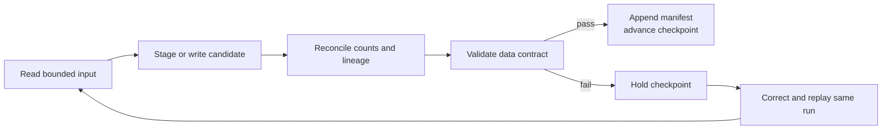

# Quality and observability

## Purpose

Quality checks in this platform are publication gates, not after-the-fact reports. A checkpoint must not advance until validation and reconciliation succeed. This keeps a failed run discoverable and replayable and prevents downstream orchestration from treating it as trusted.

> **Implementation note:** this document defines the engineering contract. The automated test suite, cross-layer metrics, and several validation suites are not complete. See [Implementation status](implementation-status.md) for verified capabilities and blockers.

## Quality control flow



The checkpoint is the orchestration publication boundary. It must identify the last successfully consumed input, not merely the latest output commit attempted by a job. A checkpoint alone does not hide a direct Iceberg commit from ad hoc readers. The recommended target is the write-audit-publish manifest in [Incremental loading](incremental-loading.md): trusted consumers resolve exact validated snapshot sets from that manifest. It is not implemented yet.

## Layer quality gates

| Layer | Minimum checks | Failure action |
|---|---|---|
| Landing | Successful source response; expected provider envelope; valid JSON/text; non-zero record count when data is expected; object size and checksum recorded | Fail ingestion and do not schedule downstream processing |
| Bronze | Required lineage fields are non-null; source object is processed once per run; payload is parseable; source-to-bronze counts reconcile | Retain the landing object, mark the run failed, and do not advance the bronze watermark |
| Silver companies | Required listing identity fields; unique listing business key; accepted exchange/currency values; schema matches the contract | Keep the previous published company snapshot and do not advance the silver watermark |
| Silver OHLC | Unique event key; `low <= open/close <= high`; non-negative volume and trade count; timestamps fall within the declared source date | Do not publish the affected source run |
| Silver news | Unique normalized URL/news key; valid publication timestamp and URL; bounded sentiment/relevance scores; child-to-parent integrity | Do not publish the parent or child tables for the run |
| Gold | Keys, relationships, SCD windows, measures, accepted values, and freshness satisfy the [gold model](gold-data-model.md) | Fail `dbt build` and do not declare a successful batch publication; individual models may already have committed |

Every transition must record input, output, and rejected-row counts. Equality is expected for source-faithful copies. If a transformation filters, deduplicates, or explodes records, its contract must state the expected count relationship.

## Reconciliation contract

One reconciliation record should be written for each dataset, input boundary, and output table:

| Field | Meaning |
|---|---|
| `dataset` | Stable identifier: `companies`, `ohlcs`, `news_sentiments`, or raw-ingestion dataset `ohlcs_history` |
| `job_name` | Processing job that produced the output |
| `run_id` | Monotonic source-ingestion identity |
| `source_date` | Provider business date when applicable |
| `source_file` | Exact S3A landing URI; manifest-based loads record the manifest URI |
| `source_checksum` | SHA-256 associated with `source_file` and propagated through lineage |
| `source_snapshot_id` | Consumed Iceberg snapshot for table-to-table transitions |
| `output_table` | Fully qualified target table |
| `output_snapshot_id` | Iceberg snapshot created by the write |
| `input_rows` | Rows read inside the declared input boundary |
| `output_rows` | Rows committed to the target |
| `rejected_rows` | Rows explicitly rejected by parsing or validation; no quarantine store is currently defined |
| `validation_status` | `passed`, `failed`, or `not_run` |
| `started_at` / `completed_at` | UTC processing interval |

The identity `(dataset, job_name, run_id, output_table)` should be unique. Retrying a run updates or verifies the same reconciliation identity; it must not create an ambiguous second success record.

## Validation ownership

| Concern | Primary mechanism | Owner |
|---|---|---|
| Provider response and landing envelope | Python assertions in the Airflow ingestion task | Ingestion boundary |
| Raw payload and lineage integrity | Great Expectations bronze suite plus reconciliation | Bronze job |
| Typed domain invariants | Great Expectations silver suites | Silver job |
| Dimensional keys and relationships | dbt schema tests and source freshness | Gold build |
| Write idempotency and watermark behavior | Integration and replay tests | Pipeline control plane |
| Service and dependency readiness | Compose validation and smoke tests | Platform bootstrap |

Great Expectations configuration is under `scripts/batch/gx/`; validation entry points are under `scripts/batch/data_validation/`. dbt tests belong beside their models and sources in `dbt/`.

## Automated test portfolio

The target suite is intentionally layered so failures identify the broken boundary:

1. **Static checks:** Python compilation and linting, YAML and Compose validation, and dbt parsing.
2. **Unit tests:** provider-envelope parsing, URL normalization, business-key generation, timestamp conversion, and watermark/ledger logic using fixed fixtures.
3. **Contract tests:** representative provider payloads checked against landing and silver contracts, including missing required fields and additive source fields.
4. **Integration tests:** MinIO to Spark to Iceberg processing in an isolated catalog namespace with deterministic input.
5. **Replay tests:** process the same `run_id` twice and assert unchanged business keys, row counts, and published watermark.
6. **Ordering tests:** prove that an older business date with a new increasing `run_id` is consumed normally, and that the target ledger recovers a late-discovered ID below the watermark exactly once.
7. **dbt tests:** uniqueness, not-null, accepted-value, relationship, and freshness checks.
8. **Bootstrap smoke test:** start with empty local state and take one companies, OHLC, and news fixture through its expected gold output.

The repository does not currently contain this complete automated suite or CI workflow. A successful developer-local execution is therefore evidence of a run, not regression coverage.

## Observability contract

Every task and Spark job should emit the same correlation fields as structured logs:

```text
dataset
layer
job_name
run_id
source_date
source_file or source_snapshot_id
source_checksum
output_table and output_snapshot_id
input_rows, output_rows, rejected_rows
duration_ms
validation_status
```

These fields must let an operator answer, without reading application code:

- What is the latest successfully published input for each dataset and layer?
- Which landing object and bronze snapshot produced a selected silver row?
- At which boundary did row counts change, and why?
- Is a pipeline delayed because the provider had no data, extraction failed, validation failed, or publication failed?
- Can the failed run be replayed without deleting a table or manually moving a watermark?

Airflow already provides task-level events and the ingestion code records object paths. Cross-layer correlation, reconciliation tables, metrics, and alerting remain target capabilities.

## Suggested service-level indicators

These are useful local-development metrics now and natural production SLIs later:

| Signal | Definition |
|---|---|
| Freshness lag | Current UTC time minus latest successfully published source event/date |
| Processing latency | Successful publication time minus landing completion time |
| Run success ratio | Successful logical runs divided by attempted logical runs over a window |
| Rejection ratio | Rejected rows divided by input rows per run |
| Reconciliation delta | `input_rows - output_rows - rejected_rows`, adjusted for documented explode/deduplicate semantics |
| Replay stability | Change in business-key set and row count after replaying the same logical run |
| Checkpoint backlog | Count of eligible unprocessed runs/snapshots, plus age of the oldest unprocessed input |

Thresholds should be dataset-specific. For example, a monthly companies feed and a daily OHLC feed cannot share one freshness objective.

## Gold publication scope

A normal multi-model `dbt build` is not an atomic platform-wide release. A model can commit before a later model or test fails. Until a release-schema/view-swap or batch-manifest strategy is selected, publication status is per model and the overall build is successful only when the complete selected DAG passes. Consumers that require a mutually consistent set of gold models must wait for an explicit successful build record.

## Definition of done

The platform is reproducible end to end only when all of these are demonstrated:

- [ ] One documented command sequence bootstraps the infrastructure from an empty supported environment.
- [ ] Required containers become healthy with compatible Spark, Iceberg, Hadoop AWS, and Hive dependencies.
- [ ] Airflow connections can be provisioned without UI-only steps or committed secrets.
- [ ] One fixture for each dataset reaches landing, bronze, silver, and its expected gold model.
- [ ] Actual object paths, schemas, grains, partitions, and write modes match the documented contracts.
- [ ] Re-running one logical run creates no duplicate business keys or ambiguous reconciliation records.
- [ ] An older source date with a new increasing `run_id` is processed normally, and a late-discovered ID below the watermark is recovered through the ledger.
- [ ] Every silver row exposes lineage to a landing object and bronze run/snapshot.
- [ ] Layer checkpoints advance only after reconciliation and validation pass.
- [ ] Direct consumers can resolve only a validated snapshot/model release, including after a post-commit validation failure.
- [ ] Great Expectations validations and `dbt build` tests pass from a clean state.
- [ ] Automated tests run in CI without developer-local data or credentials.
- [ ] Backup, reset, and failure-recovery procedures have been exercised, not only documented.

## Related documents

- [Data contracts](data-contracts.md)
- [Gold data model](gold-data-model.md)
- [Incremental loading](incremental-loading.md)
- [Operations](operations.md)
- [Implementation status](implementation-status.md)
- [Documentation index](README.md)
- [Project README](../README.md)
